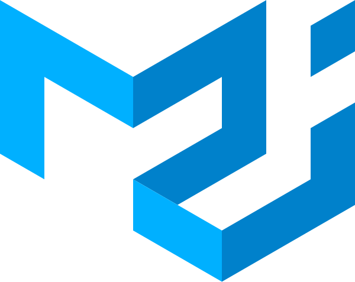

 

  
  
  <h3 align="center"> 🍝 <b> Restro Stepper </b> </h3>

  

    The React Project    
  

 
 

## 🚀 How to use

- Install packages with `yarn` or `npm install`.
- Run `yarn start` to start the bundler.

 

## 🎯 What is *Stepper*

- Steppers convey progress through numbered steps.

- Steppers display progress through a sequence of logical and numbered steps. They may also be used for navigation. 

- Steppers may display a transient feedback message after a step is saved.

- Steppers display progress through a sequence by breaking it up into multiple logical and numbered steps.
 

&nbsp;
## 💻 About

This Project  is used for register **Meal Plan** . User have to select Type of Meal, Restaurant, Dishes then they get the Review at last step. App have **Nice UI**, also It is Easy to use. 

&nbsp;

- In ***First step*** user will select type of Meal and People. 

    

&nbsp;

- In ***Second step*** user will select the Restaurant. 

    

&nbsp;

- In ***Third step*** user will select the Dishes.

    

&nbsp;

- In ***Fourth step*** user will get the Review of selections. 

    

&nbsp;

- After ***Step Completion*** user Thank you message will be displayed. 

    

 
 

## Built With

 

* &nbsp;  **React**

 

* &nbsp;  **Material UI**

 

